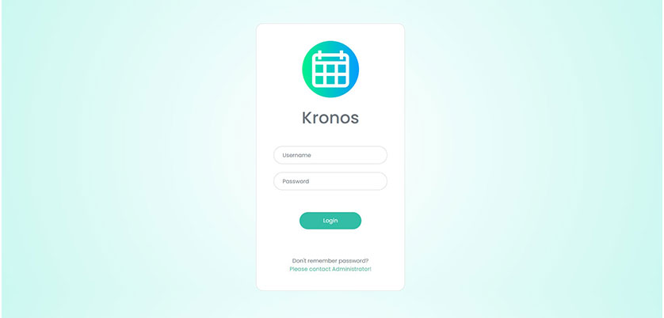
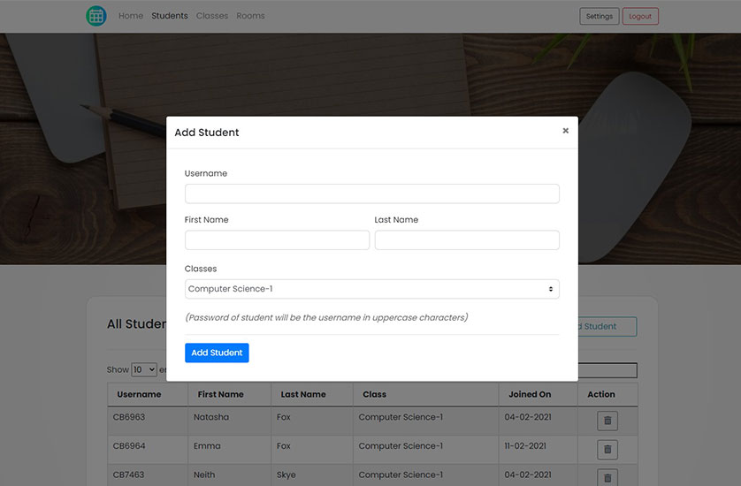

# Kronos
Kronos is an attractive, powerful and scalable system to manage lectures and related activities in a university environment.

Solution comprises of many J2EE and SE features including but not limited to,

- Context and Dependency Injection
- Interceptors
- Bean validation
- Java Security
- Java Servlets including JSP and JSTL
- Java Persistance API
- Java transactions API
- Java Mail

